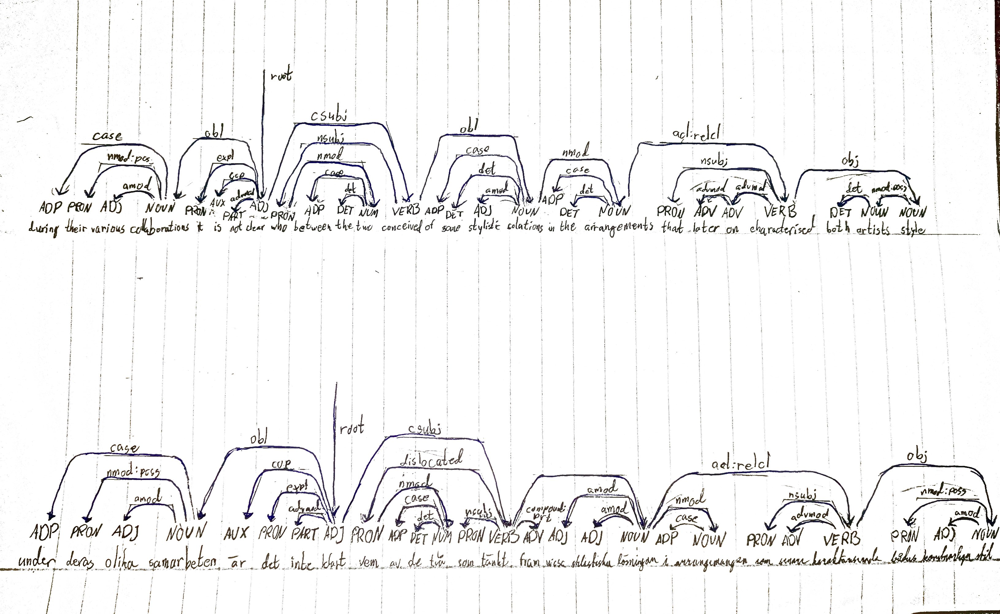
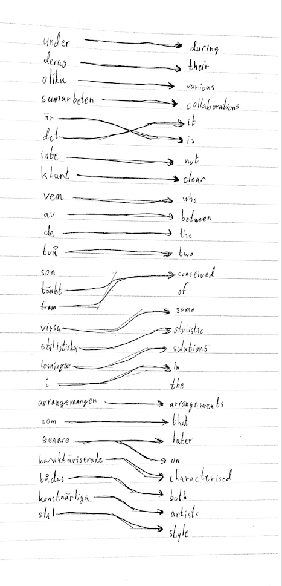

# Lab 1: Grammatical analysis

This lab follows Chapters 1-4 in the course notes. Each part is started after the lecture on the corresponding chapter.
The assignments are submitted via Canvas.

## Chapter 1: explore the parallel UD treebank (PUD)

### Frequencies of POS tags and dependency labels statistics 

Top 20 POS tags for Swedish vs. English from `cat sv_pud-ud-test.conllu | gfud statistics POS DEPREL` and `cat en_pud-ud-test.conllu | gfud statistics POS DEPREL`
<pre><code>
---------------------            ----------------------
|     Swedish       |            |      English       |
---------------------            ----------------------
(["ADP","case"],2141)            (["PUNCT","punct"],2451)
(["PUNCT","punct"],1941)         (["ADP","case"],2339)
(["ADJ","amod"],1211)            (["DET","det"],2047)
(["DET","det"],1009)             (["ADJ","amod"],1226)
(["NOUN","obl"],945)             (["NOUN","obl"],829)
(["NOUN","nmod"],829)            (["VERB","root"],797)
(["VERB","root"],777)            (["ADV","advmod"],770)
(["ADV","advmod"],748)           (["NOUN","nmod"],724)
(["NOUN","obj"],699)             (["NOUN","obj"],690)
(["NOUN","nsubj"],625)           (["NOUN","nsubj"],598)
(["PRON","nsubj"],595)           (["CCONJ","cc"],565)
(["CCONJ","cc"],593)             (["PRON","nsubj"],477)
(["AUX","aux"],369)              (["NOUN","compound"],434)
(["AUX","cop"],343)              (["AUX","aux"],410)
(["SCONJ","mark"],341)           (["PROPN","compound"],324)
(["PART","mark"],313)            (["AUX","cop"],316)
(["VERB","advcl"],283)           (["PROPN","nmod"],283)
(["NOUN","conj"],278)            (["PROPN","nsubj"],281)
(["NUM","nummod"],275)           (["SCONJ","mark"],280)
(["VERB","acl:relcl"],271)       (["AUX","aux:pass"],274)

</code></pre>

#### What does this tell you about the language?

The first thing I notice, is that English has a higher uses of determiners than Swedish, 2047 vs 1009. I would think that this is the use of "the" for definites, while Sweidsh ads the definite article at the end of words. English also has a fairly high use of noun compound, 758 in total for noun and proper noun compounds combined, while Swedish does not. This is likely due to compounds being written as one word in Swedish, combining one or several words to one. Thus, there would be none or few words tagged as compound.

### Convert four trees from CoNLL format to graphical trees by hand, on paper.

#### Short English tree (5-10 words, of your choice) and its translation.

- Swedish: Det är hans dröm att sluta sin karriär här.
- English: It is his dream to end his career here.

#### Long English tree (>25 words) and its translation.

- Swedish: Under deras olika samarbeten är det inte klart vem av de två som tänkt fram vissa stilistiska lösningar i arrangemangen som senare karaktäriserade bådas konstnärliga stil.
- English: During their various collaborations, it is not clear who between the two conceived of some stylistic solutions in the arrangements that later on characterised both artists' style.

### Draw word alignments for some non-trivial example in the PUD treebank, on paper.
Use the same trees as in the previous question.
What can you say about the syntactic differences between the languages?

